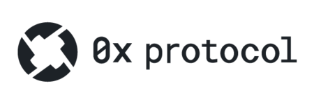

# What is 0x?

## Overview

`이더리움 블록체인`에서 분산 거래를 위한 `개방형(=무허가형)` 프로토콜이다.  
DApp을 구동하기 위해 다른 프로토콜과 결합 될 수 있는 기본 `빌딩 블록 역할`을 한다.

0x Protocol을 이용하면 Smart Contract를 통해 `ERC 20 코인`을 `P2P로 거래`할 수 있다.  
각 DApp들은 `Public Liquidity Pool` 또는 `Liquidity Pool`을 만들어 이 위에서 발생하는 수수료를 얻는다.  

`0x Token`은 0x Protocol의 업데이트 매커니즘을 통해 프로토콜을 업데이트하고 개선하는 `분산 거버넌스`에도 사용된다.  

## Features

기존의 탈중앙화 거래소는 모든 거래가 블록체인에 기록되기 때문에,  
매수 또는 매도 주문을 넣을 때마다 블록체인에 기록하기 위한 수수료가 발생했다.  
또한 주문을 취소하는 것도 하나의 트랜잭션으로 보고 수수료를 부과했다.  

이러한 단점을 극복하고자 0x는 매수 또는 매도 주문은 거래소 자체의 Database에만 기록하고  
블록체인에 올리지 않으며, 실제로 체결되는 거래 기록만 블록체인에 반영하는 `오프체인 방식`이다.  

이를 통해 거래 수수료를 절감하고 거래 처리 속도를 향상시켰다.  

1. 메시지 포맷
   - 각 주문은 `주문 매개 변수`와 `관련 서명`을 포함하는 데이터 패킷
   - 주문 매개 변수들은 `Keccak SHA3` 기능을 통해 32바이트로 연결되고 해시
   - 주문 발신자는 `ECDSA 서명`을 생성하기 위해 `비공개 키`를 사용하여 오더 해시 생성

2. P2P Order
   - P2P Order를 통해 두 거래자가 `메시지 릴레이`  
     - 이때 선호되는 통신 매체를 통해 토큰 직접 교환  
   - 주문을 구성하는 데이터 패킷은 `이메일, 페이스북 메시지 또는 이와 같은 서비스`를 통해  
전송될 수 있는 `수백 바이트의 16진수`
     - 이 주문은 지정된 수취인 주소로만 채워질 수 있음

3. Broadcast Orders
   - 모든 사람이 `xChange`로 행동하고, 공개 또는 비공개의 `OrderBook`을 유지하고,  
결과로 나오는 모든 유동성에 대해 거래 수수료를 부과함  
     - _"유동성 시장을 건설하기 위해 구매자와 판매자가 주문을 게시할 수 있는 공공장소가 있어야 하고,  
주문은 이후 주문서, 즉 교환으로 집계된다.   
거래소를 설립하고 운영하는 것은 비용이 많이 들고 기존의 프로토콜은 해당 비용을 감당할 인센티브를 제공하지 못한다. "_
     - ~~오프체인에 대한 설명 같음~~
   - 중개인은 일반 메시지로 구성된 주문서를 호스팅 및 보급해 참여자간 신호 전달  
   - 중개인은 참여자를 대신하여 거래 할 수 없음
     - 대신, 구매자들은 자체 거래 실행  

4. 스마트 컨트랙트
   - 교환 프로토콜은 공개적으로 액세스 가능
   - 이더리움 스마트 컨트랙트 내 구현(`Solidity`)
     - `Fill`과 `Cancel` 기능 
   - 주문을 완료하기 위해 `약 90k`의 가스 비용 소모  

5. 서명 인증
   - 교환 스마트 컨트랙트는 `ecrecover` 함수를 사용해 주문 발송자 서명 인증  
   - `ecrecover` 함수는 해시와 해시 서명을 인수로 사용해 서명을 생산한 `공개 키` 반환  
   - `ecrecover`에 의해 반환된 공개키가 `제조업체 주소`와 같은 경우 서명은 인증됨  

6. Fills & Partial Fills
   - 교환 스마트 컨트랙트는 이전의 주문에 대한 각각의 참조를 저장하여 단일 주문이 여러 번 저장되는 것 방지  
     - 이 참조는 매핑 내에 저장  
     - 32바이트의 `Data chunk`를 256비트의 부호 없는 정수로 매핑하는 데이터 구조  
   - 명령과 관련된 매개 변수를 Keccak SHA3 함수에 전달하고, 해당 순서를 식별하는데 사용되는  
고유한 32바이트 해시가 생김
   - 주문이 채워질 때마다 <u>매핑은 주문 해시와 저장된 누적 값을 저장</u> 
   - 구매자는 교환 스마트 컨트랙트의 저장 기능을 호출할 때 `valueFill`이라는 추가 인수를  
지정하여 부분적으로 주문을 저장  
     - 다양한 부분 저장의 합계가 주문의 전체 가치를 초과하지 않는 한 <u>하나의 주문에서  
     여러 부분의 저장이 실행될 수 있음</u>  

7. 만료 시간
   - 주문이 서명된 시점의 판매자에 의해 주문 만료 시간이 지정됨  
     - 만료 시간은 유닉스 `epoch` 이후의 절대시간을 나타내는 부호 없는 정수값  
     - 이 값은 서명 되면 변경 불가능  
   - 이더리움 가상 머신 내의 시간은 새로운 블록이 채워질 때마다 설정되는 `블록 타임 스탬프`에 의해 결정  
   - 주문의 만료 상태는 구매자가 주문을 작성하려는 의도를 전달하는 시간에 의존하지 않고,  
   `채굴 기능`이 마이너에 의해 EVM에서 실행되는 시간에 따라 달라짐
     - _"채굴이 있다!"_  

8. 주문 취소
   - 판매자는 잔여 주문 및 만료되지 않은 주문을 교환 스마트 컨트랙트의 `취소 기능`을 통해 취소 가능  
   - 취소 기능은 주문의 해시를 주문의 최대값(`valueA`)에 매핑하여 `후속 저장 방지`  
   - 취소 기능은 가스를 소비하므로 대체 매커니즘으로만 사용  
   - 이 방법의 문제점은 
     - 구매자가 동일한 주문을 저장하려 할 때
     - 동시에 주문을 취소하려고 하는 상황일 때
     - 두 거래가 `채굴되는 순서`에 따라 두 당사자 거래 중 하나가 `실패`하여 `가스 낭비` 초래

9. 프로토콜 토큰
   - `0x`는 기본적으로 암호화된 프로토콜이 아님
   - `0x`는 구매자와 판매자 사이의 신호 전달을 용이하게 하기 위해 사용되는 `암호 경제 프로토콜`  
     - _"하지만 교환 기능을 통합한 DApp의 개방형 표준으로 사용된다."_ 
     - _"즉, 분산 거버넌스를 통해 스마트 컨트랙트의 변하지 않는 시스템 내에서 구현되는 프로토콜의 미래를 보장할 수 있다."_  

