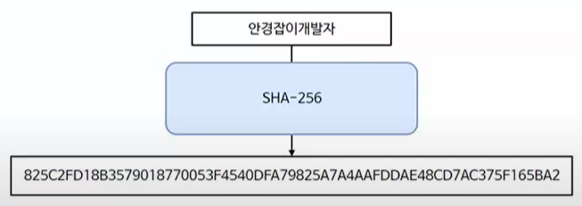
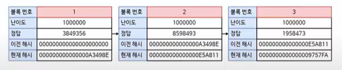
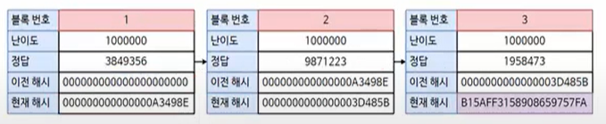
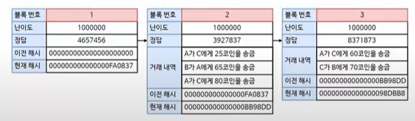

# SHA256

표준 해시 알고리즘

MD5보다 더 긴 256bit   
총 64자리 길이의 문자열 반환

## 블록체인에서의 동작

해시로 시작해 해시로 끝나는 암호 기반 기술  

채굴
- 하나의 블록을 생성해서 체인을 형성하는 행위
- 현재 블록에서 특정 난이도를 만족하는 정답값(nonce)을 찾는 행위  
- nonce는 무차별 대입으로 찾게 되어있음 
- 난이도가 1000000일 경우, 현재 해시의 값이 난이도 값보다 작거나 같아야 한다는 의미
- 다음 블록부터는 이전 블록의 해시값이 현재 블록의 해시값에 활용됨
- 이전 해시와 정답값을 해시로 처리한 그 값이 난이도보다 작아야지 채굴에 성공했다고 함 

  
- 이렇게 하는 이유는 블록체인을 위변조로부터 방어하기 위함

- 실제로 각 블록에는 거래내역 정보가 포함
- 새로운 거래 내역이 만들어지기 까지 발생한 거래 내역을 담는다
- 거래 내역에 대한 무결성을 해시값이 보장한다
- 따라서 한 번 성사된 거래는 돌이키기 어렵다. (해시값이 변하기 때문에)
- 설령 채굴자 C가 몇 건의 블록체인 형성에 성공한다 하더라도,
- 다른 채굴자들 A, B의 장부가 그 채굴자 C의 장부와 다르다면 그 채굴자의 장부는 정상적이지 않다고 판단해 네트워크를 방어한다.
- 하지만 어떤 채굴자 C의 네트워크 장악력이 전체 네트워크의 50%를 초과한다면 올바른 장부라 선택될 수 있다.
  - 합의 알고리즘에 의해서
- 그러나 실제로 50%를 초과할 확률은 희박하다. 