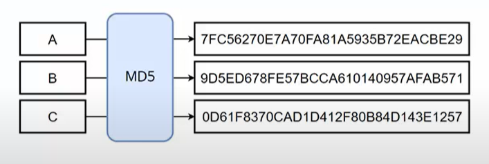
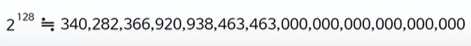
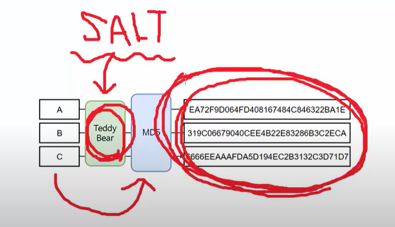
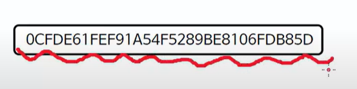

# 해시

해시를 이용해 정상적인 데이터라는 것을 검증할 수 있다.  

원데이터 -> 해시 -> 원데이터를 상징하는 특정 길이의 데이터

원데이터가 조금만 바뀌어도 결과는 상당히 달라진다.

해시는 기본적으로 복호화가 불가능하다.

결과값으로 원데이터를 유추하기 힘들다. 

해시에서 입력값은 수학적으로 무한일 수 있지만, 결과값은 정해진 경우의 수가 있기 때문에 한정적으로

입력값의 집합이 더 크다. 따라서 한정적인 수의 결과값으로 무한에 가까운 입력값을 찾기란 힘들다.

## 비둘기 집의 원리  

MD5는 2의 128 제곱의 경우의 수를 갖으며, 그 중에 한 개의 32길이 데이터를 반환한다. 

비둘기가 들어갈 수 있는 4개의 집, 비둘기는 5마리 
한마리도 빠짐없이 집에 들어가야 한다면,
최소 한 집에는 2마리의 비둘기가 들어가야 한다. 

즉, 어떠한 해시 알고리즘이더라도 결과가 동일한 해시값이 2개 존재할 수 있다.
(충돌 가능성)
 
## 레인보우 테이블 공격

해시의 복호화를 가능할 수도 있게 만드는 공격

123456 -> 0~99999999 라는 해시사전을 해커가 만들어 대입한다면
해시의 원래 데이터가 무엇이었는지 찾아낼 수 있다. 

해결

SALT 값 넣기

원본 데이터를 찾아내기 어렵게 하기 위해서 결과인 해시값을 바꾸어 공격을 막는다. 

## MD5 복호화 해킹 공격

레인보우 테이블의 활용  
https://www.md5online.org/md5-decrypt.html 처럼 
미리 온라인 상에서 레인보우 테이블이 정의된 도구를 활용해 복호화할 수도 있다. 

