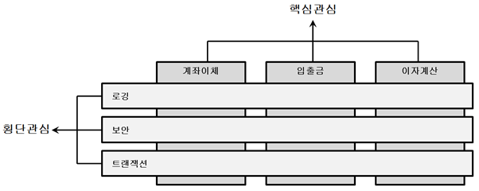
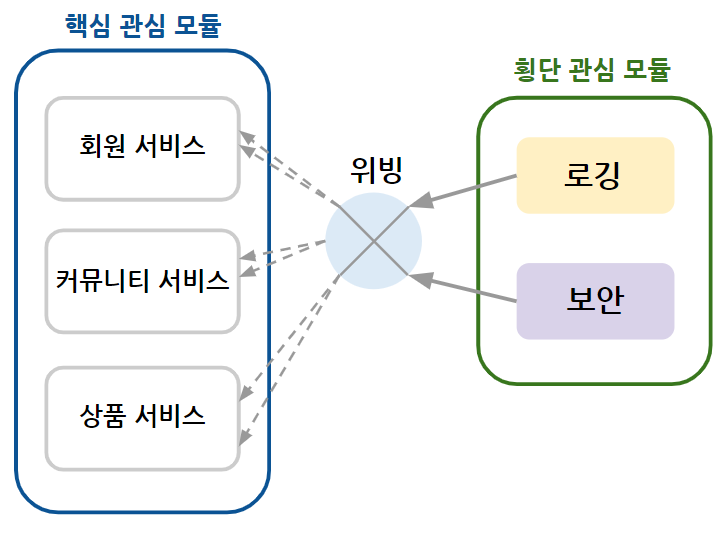
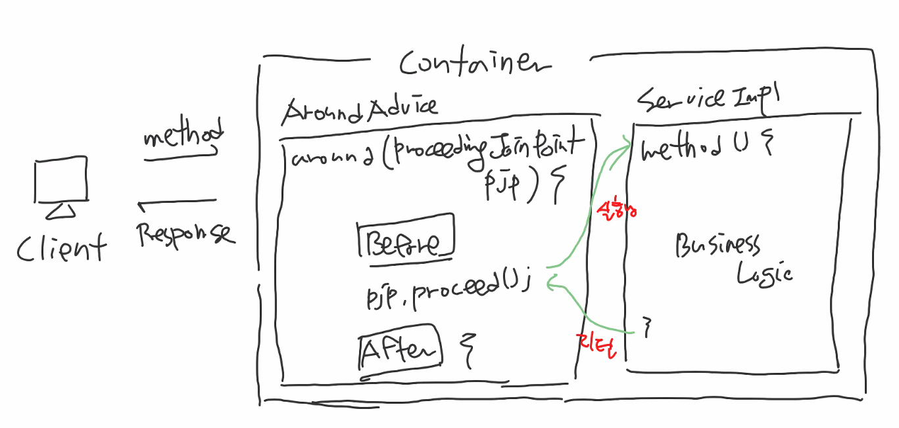

# AOP란?

## 관점지향 프로그래밍(AOP)

- 핵심 비즈니스 로직과 비즈니스 메서드마다 반복 등장하는 **공통 로직** 을 분리
- 응집도를 높게 유지
- **공통 로직** 을 외부에 독립된 클래스로 분리하고, (기능의 분리 관리 -> 유지보수성 향상)
  해당 기능을 소스코드에 명시하지 않고 선언적으로 처리하고 적용함

## AOP 이해하기

애플리케이션을 개발하다 보면 실제 핵심 비즈니스 로직은 몇 줄 안되고,
주로 로깅이나 예외, 트랜잭션 처리 같은 부가 코드가 대부분이다.
이러한 부가 코드들로 인해 비즈니스 메소드의 복잡성이 증가하고 개발자를 지치게 한다.
하지만 이런 부가 코드 역시 비즈니스 로직만큼 중요한 기능이다.
중요한 점은 이런 부가 코드를 매번 반복하지 않는 것이다.

### AOP 이해하기 - 관심분리(Separation of Concerns)



AOP에서는 메소드마다 공통으로 등장하는 로깅, 예외, 트랜잭션 처리 같은 코드들을 **횡단관심(Crosscutting Concerns)** 라고 한다.
이에 반해 사용자의 요청에 따라 실제로 수행되는 핵심 비즈니스 로직을 **핵심관심(Core Concerns)** 라고 한다.
이 두 관심을 분리할 수 있다면, 우리가 구현하는 메소드에 실제 비즈니스 로직만으로 구성할 수 있으므로 **더욱 간결하고 응집도 높은 코드를 유지** 할 수 있다.

- 기존의 OOP에서는 완벽한 관심 분리가 어렵지만, AOP를 통해 문제를 해결하고 OOP를 더욱 OOP스럽게 만들어 준다.
- 스프링 AOP는 클라이언트가 핵심 관리에 해당하는 비즈니스 메소드를 호출할 때, 횡단 관심에 해당하는 메소드를 적절히 실행해준다.

#### AOP 라이브러리 추가

```xml
<!-- https://mvnrepository.com/artifact/aspectj/aspectjrt -->
<dependency>
    <groupId>aspectj</groupId>
    <artifactId>aspectjrt</artifactId>
    <version>1.5.4</version>
</dependency>

<!-- https://mvnrepository.com/artifact/aspectj/aspectjweaver -->
<dependency>
    <groupId>aspectj</groupId>
    <artifactId>aspectjweaver</artifactId>
    <version>1.5.4</version>
</dependency>

```

#### 네임스페이스 추가 및 AOP 설정

스프링 설정 파일(applicationContext.xml)에서 [Namespaces] 탭을 선택하고 aop 네임스페이스를 추가한다.

```xml
<bean id="log" class="com.fn.block.Common.LogAdvice"></bean>
<aop:config>
    <aop:pointcut id="allPointCut" expression="execution(* com.fn.block.Service..*Impl.*(..))"/>
    <aop:aspect ref="log">
        <aop:before pointcut-ref="allPointCut" method="pringLogging"/>
    </aop:aspect>
</aop:.config>
```

# AOP 용어 정리

## 조인포인트

- 클라이언트가 호출하는 모든 비즈니스 메소드
- 조인포인트 = 포인트컷 대상 = 포인트컷 후보(조인포인트에서 포인트컷이 선택되기 때문에)

## 포인트컷

- 선택된 조인포인트
- 우리가 원하는 특정 메소드에서만 횡단 관심에 해당하는 공통 기능을 수행시키기 위해 필요

## 어드바이스

- 횡단 관심에 해당하는 공통 기능의 코드
- 독립된 클래스의 메소드로 작성
- 이 메소드가 언제 동작할지 스프링 설정 파일에서 설정

## 위빙

- 포인트컷으로 지정된 핵심 관심 메서드가 호출될 때,
- 어드바이스에 해당하는 횡단 관심 메서드가 삽입되는 과정
- 위빙을 통해서 비즈니스 메서드를 수정하지 않고도 횡단 관심에 해당하는 기능을 추가/변경 가능



## 어드바이저(Advisor) 또는 애스팩트(Aspect)

- AOP의 핵심
- 포인트컷 + 어드바이스
- 어떤 포인트컷 메서드에 어떤 어드바이스 메서드를 실행할지 결정

```xml
    <aop:config>
        <aop:pointcut id="..." expression="..."/>
        <aop:aspect ref="log">
            <aop:before pointcut-ref="getPointcut" method="printLog"/>
        </aop:aspect>
    </aop:config>
```

- **트랜잭션 설정** 상황에서는 \<aop:aspect\> 대신에 \<aop:advisor\>를 사용

### \<aop:advisor\> 대한 보충 설명

만약 어드바이스 객체의 아이디를 모르거나 메서드 이름을 확인할 수 없을 때는 애스팩트를 설정할 수 없다.

```xml
<bean id='txManager' class='org.springframework.com.jpa.JpaTransactionManager'>
    <property name='entitiyManagerFactory' ref='entityManagerFactory'></property>
</bean>
```

위의 어드바이스 아이디는 txManager이지만 메서드 이름을 확인할 수 없다.

```xml
<tx:advice id="txAdvice" transaction-manager='txManager'>
    <tx:attributes>
        <tx:method name="get*" read-only="true"/>
        <tx:method name="*"/>
    </tx:attributes>
</tx:advice>

<aop:config>
    <aop:pointcut id="allPointcut" expression="execution(* com.fn.block.SideDishMarket..*Impl.*(..))"/>
    <aop:advisor pointcut-ref="allPointcut" advice-ref="txAdvice"/>
</aop:config>
```

따라서 위 과정처럼 스프링 컨테이너는 설정 파일에 등록된 \<tx:advice\>를 해석하여 트랜잭션 관리 기능 어드바이스 객체를 메모리에 생성해준다.

# 포인트컷 표현식

- 어드바이스 메서드가 적용될 비즈니스 메서드를 정확하게 필터링하기 위해 필요

## 표현식 전체 구조

```xml
execution(* com.fn.block.SideDishMarket..*Impl.get*(...))
```

| \*       | com.fn.block.SideDishMarket.. | \*Impl   | get\*    | (...)    |
| -------- | ----------------------------- | -------- | -------- | -------- |
| 리턴타입 | 패키지 경로                   | 클래스명 | 메서드명 | 매개변수 |

### 리턴타입 지정

| 표현식 | 설명                               |
| ------ | ---------------------------------- |
| \*     | 모든 리턴타입 허용                 |
| void   | 리턴타입이 void인 메서드 선택      |
| !void  | 리턴타입이 void가 아닌 메서드 선택 |

### 패키지 지정

| 표현식                              | 설명                                                                                           |
| ----------------------------------- | ---------------------------------------------------------------------------------------------- |
| com.fn.block.SideDishMarket.Service | 정확하게 com.fn.block.SideDishMarket.Service 패키지만 선택                                     |
| com.fn.block.SideDishMarket..       | com.fn.block.SideDishMarket 패키지로 시작하는 모든 패키지 선택                                 |
| com.fn.block.SideDishMarket..Impl   | com.fn.block.SideDishMarket 패키지로 시작하면서 마지막 패키지 이름이 Impl로 끝나는 패키지 선택 |

### 클래스 지정

| 표현식           | 설명                                                                                                       |
| ---------------- | ---------------------------------------------------------------------------------------------------------- |
| BoardServiceImpl | 정확하게 BoardServiceImpl 클래스만 선택                                                                    |
| \*Impl           | 클래스 이름이 Impl로 끝나는 클래스만 선택                                                                  |
| BoardService+    | BoardService로부터 파생된 모든 자식 클래스 선택(만약 인터페이스 뒤에 +가 붙으면 해당 인터페이스를 구현한 ) |

### 메서드 지정

| 표현식    | 설명                                            |
| --------- | ----------------------------------------------- |
| \*(..)    | 가장 기본 설정으로 모든 메서드 선택             |
| get\*(..) | 메서드 이름이 get으로 시작하는 모든 메서드 선택 |

### 매개변수 지정

| 표현식                                 | 설명                                                                                 |
| -------------------------------------- | ------------------------------------------------------------------------------------ |
| (..)                                   | 매개변수의 개수, 타입에 무제약                                                       |
| (\*)                                   | 반드시 1개의 매개변수를 갖는 메서드 선택                                             |
| (com.fn.block.SideDishMarket.UserDTO)  | 매개변수로 UserDTO를 갖는 메서드만 선택                                              |
| !(com.fn.block.SideDishMarket.UserDTO) | 매개변수로 UserDTO를 갖지 않는 메서드만 선택                                         |
| (Integer, ..)                          | 1개 이상의 매개변수를 갖되, 첫 번째 매개변수의 타입은 Integer인 메서드만 선택        |
| (Integer, \*)                          | 반드시 2개 이상의 매개변수를 갖되, 첫 번째 매개변수의 타입이 Integer인 메서드만 선택 |

# 어드바이스 동작 시점

| 동작 시점 | 설명                                                                     |
| --------- | ------------------------------------------------------------------------ |
| Before    | 비즈니스 메서드 실행 전 동작                                             |
|           | After Returning: 비즈니스 메서드가 성공적으로 리턴되면 동작              |
| After     | After Throwing: 비즈니스 메서드 실행 중 예외가 발생하면 동작             |
|           | After: 비즈니스 메서드가 실행된 후, 무조건 실행                          |
| Around    | 메서드 호출 자체를 가로채 비즈니스 메서드 실행 전후에 처리할 로직을 삽입 |

어드바이스 메서드의 동작 시점은 \<aop:asecpt\> 하위에 각각

- \<aop:before\>
- \<aop:after-returning\>
- \<aop:after-throwing\>
- \<aop:after\>
- \<after-around\>

로 지정한다.

## Around 어드바이스 보충 설명

하나의 어드바이스가 비즈니스 메서드 실행 전과 후에 모두 동작하여 로직을 처리하는 경우에 사용한다.

  

Around 어드바이스는 클라이언트의 메서드 호출을 가로챈다.
그래서 클라이언트가 호출한 비즈니스 메서드가 실행되기 전에 사전 처리 로직을 수행하고,
비즈니스 메서드가 모두 실행되고 난 후에 사후 처리 로직을 수행한다.

아래는 Around 어드바이스의 예이다.

```java
import org.aspectj.lang.ProceedingJoinPoint;

public class AroundAdvice {
    public Object aroundLog(ProceedingJoinPoint pjp) throws Throwable {
        System.out.println("[BEFORE]: 비즈니스 메서드 수행 전에 처리할 내용...");
        Object returnObj = pjp.proceed();
        System.out.println("[AFTER]: 비즈니스 메서드 수행 후에 처리할 내용...");

        return returnObj;
    }
}
```

위와 같이 작성된 Around 어드바이스를 적용하기 위해서는 스프링 설정 파일에 애스팩트 설정을 추가한다.

```xml
//applicationContext.xml
<bean id='around' class='com.fn.block.SideDishMarket.Adivce.AroundAdvice' />

<aop:config>
    <aop:pointcut id="allPointcuct" expression="execution(* com.fn.block.SideDishMarket..*Impl.*(..))"/>

    <aop:aspect ref="around">
        <aop:around pointcut-ref="allPointcut" method="aroundLog"/>
    </aop:aspect>
</aop:config>
```

# 애노테이션 기반 AOP 설정

AOP를 애노테이션으로 설정하려면 가장 먼저 스프링 설정 파일에서 \<aop:aspectj-autoproxy\> 선언해야 한다.

```xml
//applicationContext.xml
<aop:aspectj-autoproxy></aop:aspectj-autoproxy>
```

위의 엘레먼트를 선언하면 스프링 컨테이너는 AOP 관련 애노테이션들을 인식하고 용도에 맞게 처리한다.

## 포인트컷 설정

@Pointcut 애노테이션을 사용한다.

```java
//LogAdvice.java

import org.aspectj.lang.annotation.Pointcut;

@Service // Use @Service annotation for AOP based on annotation.
public class LogAdvice {
    @Pointcut("execution(* com.fn.block.SideDishMarket.Service..*Impl.*(..))")
    public void allPointcut(){}

    @Pointcut("execution(* com.fn.block.SideDishMarket.Service..*Impl.get*(..))")
    public void getPointcut(){}
}
```

## 애스팩트 설정

애스팩트는 어드바이스 + 포인트컷의 결합이라고 했다.
@Aspect 애노테이션을 사용한다.

```java
//LogAdvice.java

import org.aspectj.lang.annotation.Pointcut;

// add packages
import org.aspectj.lang.annotation.Before;
import org.aspectj.lang.annotation.Aspect;

@Service // Use @Service annotation for AOP based on annotation.
@Aspect
public class LogAdvice {
    @Pointcut("execution(* com.fn.block.SideDishMarket.Service..*Impl.*(..))")
    public void allPointcut(){}

    @Pointcut("execution(* com.fn.block.SideDishMarket.Service..*Impl.get*(..))")
    public void getPointcut(){}

    @Before("allPointcut()")
    public void printLog() {
        System.out.println("[Common Log] Logging before Business Logic processing");
    }
}
```

## 어드바이스 동작 시점 총정리

### Before 어드바이스

```java
import org.aspectj.lang.JoinPoint;
import org.aspectj.lang.annotation.AfterReturning;
import org.aspectj.lang.annotation.Pointcut;
import org.aspectj.lang.annotation.Before;
import org.aspectj.lang.annotation.Aspect;

@Service
@Aspect
public class LogAdvice {
    @Pointcut("execution(* com.fn.block.SideDishMarket.Service..*Impl.*(..))")
    public void allPointcut(){}

    @Pointcut("execution(* com.fn.block.SideDishMarket.Service..*Impl.get*(..))")
    public void getPointcut(){}

    @Before("allPointcut()")
    public void printLog(JoinPoint jp) {
        String method = jp.getSignature().getName();
        Object[] args = jp.getArgs();

        System.out.println("[Before] " + method + "() 메서드 ARGS 정보: " + args[0].toString());
    }
}
```

### AfterReturning 어드바이스

```java
import org.aspectj.lang.JoinPoint;
import org.aspectj.lang.annotation.AfterReturning;
import org.aspectj.lang.annotation.Pointcut;
import org.aspectj.lang.annotation.Before;
import org.aspectj.lang.annotation.Aspect;

@Service
@Aspect
public class LogAdvice {
    @Pointcut("execution(* com.fn.block.SideDishMarket.Service..*Impl.*(..))")
    public void allPointcut(){}

    @Pointcut("execution(* com.fn.block.SideDishMarket.Service..*Impl.get*(..))")
    public void getPointcut(){}

    @AfterReturning(pointcut="getPointcut()", returning="returnObj") // 메서드 리턴 값을 받기 위해 pointcut을 바인드 변수로 지정한다.
    public void afterLog(JoinPoint jp, Object returnObj) {
        String method = jp.getSignature().getName();

        if(returnObj instanceof UserDTO) {
            UserDTO user = (UserDTO) returnObj;
            if(user.getRole().equals("Admin")) {
                System.out.println(user.getName() + " 로그인(Admin)");
            }
        }

        System.out.println("[After Returning] " + method + "() 메서드 리턴값: " + returnObj.toString());
    }

    @Before("allPointcut()")
    public void printLog(JoinPoint jp) {
        String method = jp.getSignature().getName();
        Object[] args = jp.getArgs();

        System.out.println("[Before] " + method + "() 메서드 ARGS 정보: " + args[0].toString());
    }
}
```

### AfterThrowing 어드바이스

```java
import org.aspectj.lang.JoinPoint;
import org.aspectj.lang.annotation.AfterThrowing;
import org.aspectj.lang.annotation.AfterReturning;
import org.aspectj.lang.annotation.Pointcut;
import org.aspectj.lang.annotation.Before;
import org.aspectj.lang.annotation.Aspect;

@Service
@Aspect
public class LogAdvice {
    @Pointcut("execution(* com.fn.block.SideDishMarket.Service..*Impl.*(..))")
    public void allPointcut(){}

    @Pointcut("execution(* com.fn.block.SideDishMarket.Service..*Impl.get*(..))")
    public void getPointcut(){}

    @AfterThrowing(poincut="allPointcut()", throwing="execptObj")
    public void exceptionLog(JoinPoint jp, Exception exceptObj) {
        String method = jp.getSignature().getName();
        System.out.println(method + "() 메서드 수행 중 예외 발생!");

        if(exceptObj instanceof IllegalArgumentExcetpion) {
            System.out.println("부적합한 값이 입력되었습니다. ");
        } else if(exceptObj instanceof NumberFormatException) {
            System.out.println("숫자 형식의 값이 아닙니다. ");
        } else if(exceptObj instanceof Exception) {
            System.out.println("문제가 발생했습니다. ");
        }
    }

    @AfterReturning(pointcut="getPointcut()", returning="returnObj") // 메서드 리턴 값을 받기 위해 pointcut을 바인드 변수로 지정한다.
    public void afterLog(JoinPoint jp, Object returnObj) {
        String method = jp.getSignature().getName();

        if(returnObj instanceof UserDTO) {
            UserDTO user = (UserDTO) returnObj;
            if(user.getRole().equals("Admin")) {
                System.out.println(user.getName() + " 로그인(Admin)");
            }
        }

        System.out.println("[After Returning] " + method + "() 메서드 리턴값: " + returnObj.toString());
    }

    @Before("allPointcut()")
    public void printLog(JoinPoint jp) {
        String method = jp.getSignature().getName();
        Object[] args = jp.getArgs();

        System.out.println("[Before] " + method + "() 메서드 ARGS 정보: " + args[0].toString());
    }
}
```

### After 어드바이스

```java
import org.aspectj.lang.JoinPoint;
import org.aspectj.lang.annotation.AfterThrowing;
import org.aspectj.lang.annotation.AfterReturning;
import org.aspectj.lang.annotation.Pointcut;
import org.aspectj.lang.annotation.Before;
import org.aspectj.lang.annotation.Aspect;

@Service
@Aspect
public class LogAdvice {
    @Pointcut("execution(* com.fn.block.SideDishMarket.Service..*Impl.*(..))")
    public void allPointcut(){}

    @Pointcut("execution(* com.fn.block.SideDishMarket.Service..*Impl.get*(..))")
    public void getPointcut(){}

    @After("allPointcut()")
    public void finallyLog() {
        System.out.println("[After] 비즈니스 로직 수행 후 무조건 동작");
    }

    @AfterThrowing(poincut="allPointcut()", throwing="execptObj")
    public void exceptionLog(JoinPoint jp, Exception exceptObj) {
        String method = jp.getSignature().getName();
        System.out.println(method + "() 메서드 수행 중 예외 발생!");

        if(exceptObj instanceof IllegalArgumentExcetpion) {
            System.out.println("부적합한 값이 입력되었습니다. ");
        } else if(exceptObj instanceof NumberFormatException) {
            System.out.println("숫자 형식의 값이 아닙니다. ");
        } else if(exceptObj instanceof Exception) {
            System.out.println("문제가 발생했습니다. ");
        }
    }

    @AfterReturning(pointcut="getPointcut()", returning="returnObj") // 메서드 리턴 값을 받기 위해 pointcut을 바인드 변수로 지정한다.
    public void afterLog(JoinPoint jp, Object returnObj) {
        String method = jp.getSignature().getName();

        if(returnObj instanceof UserDTO) {
            UserDTO user = (UserDTO) returnObj;
            if(user.getRole().equals("Admin")) {
                System.out.println(user.getName() + " 로그인(Admin)");
            }
        }

        System.out.println("[After Returning] " + method + "() 메서드 리턴값: " + returnObj.toString());
    }

    @Before("allPointcut()")
    public void printLog(JoinPoint jp) {
        String method = jp.getSignature().getName();
        Object[] args = jp.getArgs();

        System.out.println("[Before] " + method + "() 메서드 ARGS 정보: " + args[0].toString());
    }
}
```

### Around 어드바이스

하나의 어드바이스로 사전, 사후 처리를 모두 해결한다.
@Around 애노테이션을 사용한다.

```java
import org.aspectj.lang.JoinPoint;
import org.aspectj.lang.annotation.AfterThrowing;
import org.aspectj.lang.annotation.AfterReturning;
import org.aspectj.lang.annotation.Pointcut;
import org.aspectj.lang.annotation.Before;
import org.aspectj.lang.annotation.Aspect;

@Service
@Aspect
public class LogAdvice {
    @Pointcut("execution(* com.fn.block.SideDishMarket.Service..*Impl.*(..))")
    public void allPointcut(){}

    @Pointcut("execution(* com.fn.block.SideDishMarket.Service..*Impl.get*(..))")
    public void getPointcut(){}

    @Around("allPointcut()")
    public void aroundLog(ProceedingJoinPoint pjp) throws Throwable {
        String method = pjp.getSignature().getName();

        StopWatch stopWatch = new StopWatch();
        stopWatch.start();

        Object obj = pjp.proceed();

        stopWatch.stop();
        System.out.println(method + "() 메서드 수행에 걸린 시간: " + stopWatch.getTotalTimeMillis() + "(ms)초");

        return obj;
    }

    @After("allPointcut()")
    public void finallyLog() {
        System.out.println("[After] 비즈니스 로직 수행 후 무조건 동작");
    }

    @AfterThrowing(poincut="allPointcut()", throwing="execptObj")
    public void exceptionLog(JoinPoint jp, Exception exceptObj) {
        String method = jp.getSignature().getName();
        System.out.println(method + "() 메서드 수행 중 예외 발생!");

        if(exceptObj instanceof IllegalArgumentExcetpion) {
            System.out.println("부적합한 값이 입력되었습니다. ");
        } else if(exceptObj instanceof NumberFormatException) {
            System.out.println("숫자 형식의 값이 아닙니다. ");
        } else if(exceptObj instanceof Exception) {
            System.out.println("문제가 발생했습니다. ");
        }
    }

    @AfterReturning(pointcut="getPointcut()", returning="returnObj") // 메서드 리턴 값을 받기 위해 pointcut을 바인드 변수로 지정한다.
    public void afterLog(JoinPoint jp, Object returnObj) {
        String method = jp.getSignature().getName();

        if(returnObj instanceof UserDTO) {
            UserDTO user = (UserDTO) returnObj;
            if(user.getRole().equals("Admin")) {
                System.out.println(user.getName() + " 로그인(Admin)");
            }
        }

        System.out.println("[After Returning] " + method + "() 메서드 리턴값: " + returnObj.toString());
    }

    @Before("allPointcut()")
    public void printLog(JoinPoint jp) {
        String method = jp.getSignature().getName();
        Object[] args = jp.getArgs();

        System.out.println("[Before] " + method + "() 메서드 ARGS 정보: " + args[0].toString());
    }
}
```

## 외부 포인트컷 참조

XML 설정으로 포인트컷을 관리했을 때 스프링 설정 파일에 여러 개의 포인트컷을 등록할 수 있었다.
그리고 애스팩트를 설정할 때 pointcut-ref 속성으로 특정 포인트컷을 참조하여 재사용 가능 했었다.
하지만 애노테이션 기반으로 변경하고나서 어드바이스 클래스마다 포인트컷 설정이 포함되었고,
비슷하거나 같은 포인트컷이 반복 선언되는 문제가 발생했다.
이러한 문제를 해결하기 위해 스프링에서는 포인트컷을 외부에 독립된 클래스에 따로 설정하도록 했다.

```java
//CommonPointcut.java

@Aspect
public class CommonPointcut {

    @Pointcut("execution(* com.fn.block.SideDishMarket..*Impl.*(..))")
    public void allPointcut() {}

    @Pointcut("execution(* com.fn.block.SideDishMarket..*Impl.get*(..))")
    public void getPointcut() {}

}
```

위의 CommonPointcut 클래스에서 정의된 포인트컷을 참조하려면 **클래스 이름, 참조 메서드 이름** 을 조합 및 지정해야 한다.

```java
// LogAdvice.java

@Service
@Aspect
public class LogAdvice {

    @Before("CommonPointcut.allPointcut()")
    public void printLog(JoinPoint jp) {
        String method = jp.getSignature().getName();
        Object[] objs = jp.getArgs();

        System.out.println("[Before] " + method + "() 메서드 ARGS 정보: " + objs[0].toString());
    }

}
```

위와 같이 클래스를 분리하여 외부 포인트컷을 참조하면 반복적인 내용을 줄일 수 있다.

끗.
