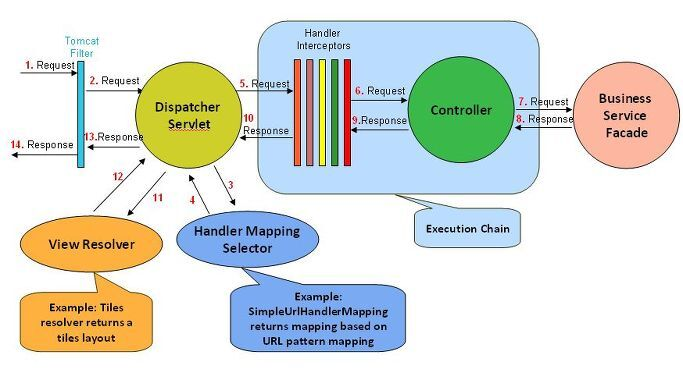
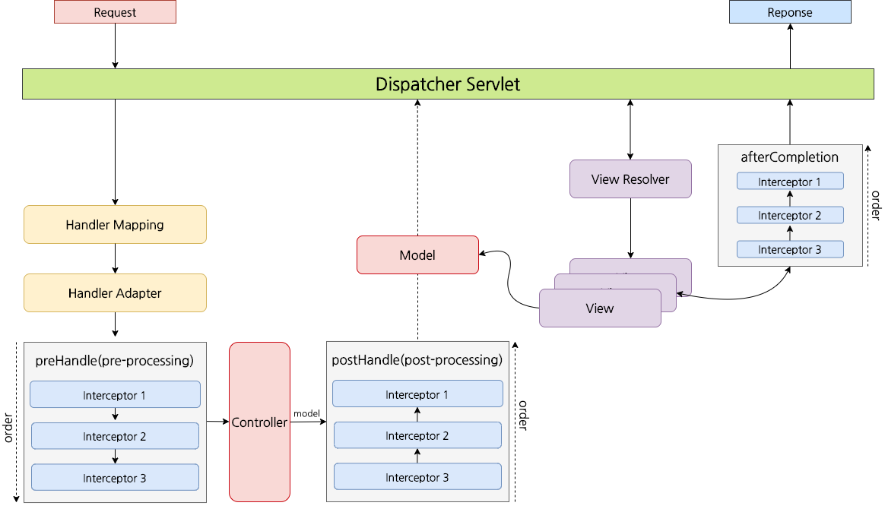

# 인터셉터(Interceptor)

- 핸들러 인터셉터(Handler Interceptor)라고 함
- 스피링이 관리 (스프링 내 모든 객체에 접근 가능)
- 인터셉터로 HttpSession에 로그인 정보 객체를 보관하면
- 컨트롤러에서 HttpSession API를 사용하지 않아도 됨
- 특정 요청이 들어오면 인터셉터는 컨트롤러로 들어오는 요청을 앞에서 가로챔

# 인터셉터의 구현 방법

1. HandlerInterceptor 인터페이스로 구현
2. HandlerInterceptorAdapter 상속해 구현

## 구현 예제

```java
package com.fn.block.Interceptor;

import javax.servlet.http.HttpServletRequest;
import javax.servlet.http.HttpServletResponse;

import org.springframework.web.servlet.handler.HandlerInterceptorAdapter;

public class LoginInterceptor extends HandlerInterceptorAdapter {

	@Override
	public boolean preHandle(HttpServletRequest request, HttpServletResponse response, Object handler)
			throws Exception {
		// TODO Auto-generated method stub
		// GET
		if (!(request.getMethod().equalsIgnoreCase("POST"))) {
			if (request.getSession().getAttribute("userId") == null) {
				response.sendRedirect("main");
				return false;
			} else {
				return true;
			}
		// POST
		} else {
			return true;
		}
	}
}
```

- Interceptor Class를 @Component로 두고,
- DI해서 스프링이 알아서 처리하게 함
- Interceptor의 preHandle에서 Session을 처리하려면
- HttpServletRequest의 request 변수의 getSession() 메소드를 활용

```java
String loginId = (String) request.getSession().getAttribute("LoginId");
```

- Interceptor에서 true를 반환 시, 컨트롤러로 요청을 넘기고,
- false를 반환 시, 컨트롤러로 요청을 넘기지 않음

## servlet-context.xml 설정

```xml
	<interceptors>
		<interceptor>
			<mapping path="/market" />
			<beans:bean
				class="com.fn.block.Interceptor.LoginInterceptor" />
		</interceptor>
	</interceptors>
```

---

# 인터셉터의 요청에 따른 특정 기능



- preHandle()
  - 실제 핸들러(컨트롤러)가 실행되기 전에 실행
  - boolean 반환
- postHandle()
  - 핸들러가 실행된 후 실행
- afterCompletion()
  - 전체 요청이 끝난 후 실행
