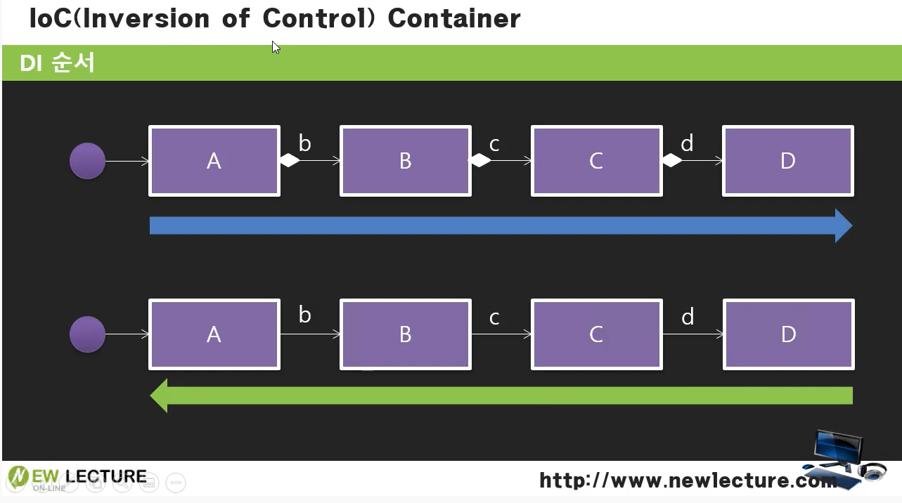

# IOC란?

## 컨테이너

- 컨테이너는 자신이 관리할 클래스들이 등록된 XML 설정 파일을 로딩하여 구동함
- 그리고 클라이언트의 요청이 들어오는 순간 XML 설정 파일을 참조하여 객체를 생성하고
- 객체의 생명주기를 관리함

## 제어의 역행(IoC)

출처: 유튜브 뉴렉처 스프링 프레임워크 강의 4강-IoC(Inversion Of Control) 컨테이너(https://www.youtube.com/watch?v=QrIp5zc6Bo4)

- 애플리케이션을 구성하는 객체 간의 낮은 결합도를 유지하게 함
- IoC가 적용되면,
- 객체 생성이나 객체와 객체 사이의 의존관계를
- 개발자가 직접 자바 코드로 처리하는 것이 아니라
- 컨테이너가 처리해줌
  - DI를 컨테이너가 자동으로 처리해줌
- 즉, 소스코드에 의존관계가 명시되지 않아 결합도가 낮아지고 유지보수가 쉬워짐
