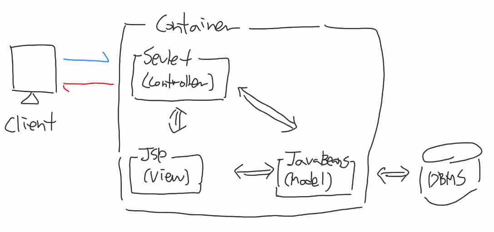

# Model 2 Architecture

구조가 단순한 Model1 아키텍처를 엔터프라이즈 규모 시스템으로 개발하기 위해서 고안된 아키텍처이다.

## MVC 모델

Model2 Architecture를 MVC 모델이라고도 한다.
MVC 모델이란 기능을 Model, View, Controller로 분리/관리하는 모델을 의미한다.

여기서 Controller가 Model2 Architecture의 핵심 개념이며, 서블릿 클래스로 구현된다.
기존에 JSP에서 담당했던 Controller를 별도의 Controller 역할을 하는 서블릿으로 옮긴 것이다.
역할만 분리했을 뿐인데 결과적으로 아래 표와 같이 개발 주체가 나뉘게 되었고,
Model1 Architecture의 문제였던 코드 뒤섞임과 유지보수의 어려움을 해결할 수 있게 되었다.

| 기능       | 구성 요소          | 개발 주체                       |
| ---------- | ------------------ | ------------------------------- |
| Model      | DTO(VO), DAO Class | 자바 개발자                     |
| View       | JSP Page           | 웹 디자이너                     |
| Controller | Servlet Class      | 자바 개발자 또는 MVC 프레임워크 |

- Controller의 경우에는 자바 개발자가 개발할 수도 있지만 MVC 프레임워크에서 제공하는 잘 만들어진 Contorller를 사용하는 것이 더 효율적이고 안정적이다.
- MVC 프레임워크에서 제공하는 Controller로 개발 할 경우의 구조는 아래 그림과 같다.

