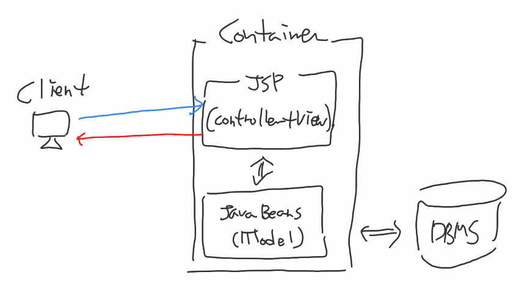

# Model 1 Architecture

- JSP + JavaBeans로만 구성되어 있는 웹 개발 아키텍처

- Bean = 객체 = JavaBeans = 자바 객체

## Model의 의미

데이터베이스 연동 로직을 제공하면서 DB에서 검색한 데이터가 저장되는 자바 객체이다.
(스프링에서 사용한 DTO, DAO가 바로 Model 객체이다. )

## Model1

- Model1 Architecture에서는 JSP가 가장 중요한 역할이다.
- 왜냐하면 JSP가 컨트롤러와 뷰의 역할을 모두 수행한다.
- 따라서 JSP에 컨트롤러에 해당하는 JAVA Code가 삽입된다.
- 이렇게 개발할 경우에는 컨트롤러와 뷰에 해당하는 코드들이 섞여서 작성되고, 유지보수하기 힘들어 진다.
