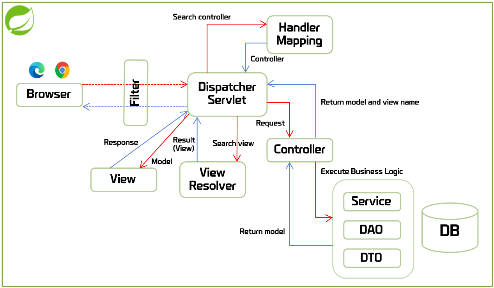

# 스프링 MVC 프레임워크

- 자바 엔터프라이즈 애플리케이션 개발을 쉽고 편하게 할 수 있도록 지원하는 오픈소스 애플리케이션 프레임워크

## 프레임워크란?

- 전체 애플리케이션의 구조를 결정하는 아키텍처의 골격 코드(틀)

## 프레임워크의 장점

- 빠르게 구현
  - 아키텍처에 해당하는 골격 코드를 제공하여
  - 개발자가 비즈니스 로직만 구현할 수 있게 함
- 쉬운 관리
  - 동일한 프레임워크로 개발시
  - 애플리케이션의 아키텍처가 같으므로
  - 관리 쉬움
  - 결과적으로 유지보수에 들어가는 인력과 시간 줄임
- 개발자 역량 획일화
  - 프레임워크 사용시
  - 숙련된 개발자와 초급 개발자의 결과물에 차이를 줄여줌
- 검증된 아키텍처의 재사용과 일관성 유지
  - 프레임워크를 사용하여 개발된 시스템은
  - 시간이 지나도 아키텍처가 왜곡되거나 변형되지 않음

# 스프링 MVC 프레임워크 특징

## POJO(Plain Old Java Object)

- 클래스를 구현하는 데 특별한 규칙이 없는 단순하고 가벼운 객체
  - 클래스 상속을 강제하지 않음
  - 인터페이스 구현을 강제하지 않음
  - 어노테이션 사용을 강제하지 않음
    - 강제하지 않는다는 것은 사용하지 않는 것이 아니라,
    - 라이브러리나 프레임워크로부터 객체를 생성하는 데 있어 자유롭다는 의미

## Not POJO

- Servlet 클래스를 의미
- Servlet에서 요규하는 규칙에 맞게 클래스를 작성해야 함
- javax.servlet, javax.servlet.http 패키지를 import
- public 클래스로 선언
- Servlet, GenericServlet, HttpServlet 중 하나를 상속
- 기본 생성자 존재
- 생명주기에 해당하는 메소드를 재정의 필요

## 제어의 역행(IoC)

- 애플리케이션을 구성하는 객체 간의 낮은 결합도를 유지하게 함
- IoC가 적용되면,
- 객체 생성이나 객체와 객체 사이의 의존관계를
- 개발자가 직접 자바 코드로 처리하는 것이 아니라
- 컨테이너가 처리해줌
- 즉, 소스코드에 의존관계가 명시되지 않아 결합도가 낮아지고 유지보수가 쉬워짐

## 관점지향 프로그래밍(AOP)

- 핵심 비즈니스 로직과 비즈니스 메서드마다 반복 등장하는 **공통 로직** 을 분리
- 응집도를 높게 유지
- **공통 로직** 을 외부에 독립된 클래스로 분리하고, (기능의 분리 관리 -> 유지보수성 향상)
- 해당 기능을 소스코드에 명시하지 않고 선언적으로 처리하고 적용함

## 컨테이너

- 특정 객체의 생성과 관리 담당
- 객체 운용에 필요한 다양한 기능 제공
- 일반적으로 서버 안에 포함되어 배포 및 구동됨
- Servlet 컨테이너, EJB 컨테이너가 대표적
- Tomcat Server에 Servlet 컨테이너가 포함됨
- 애플리케이션 운용에 필요한 객체를 생성하고
- 객체 간의 의존관계를 관리한다는 점에서
- 스프링도 일종의 컨테이너라 할 수 있음

# 스프링 프레임워크 구조 및 실행 흐름

