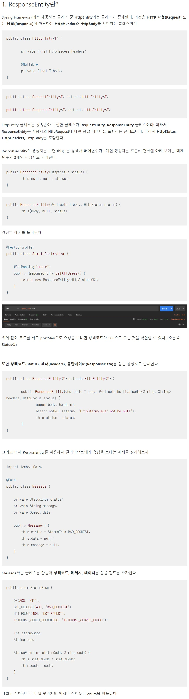
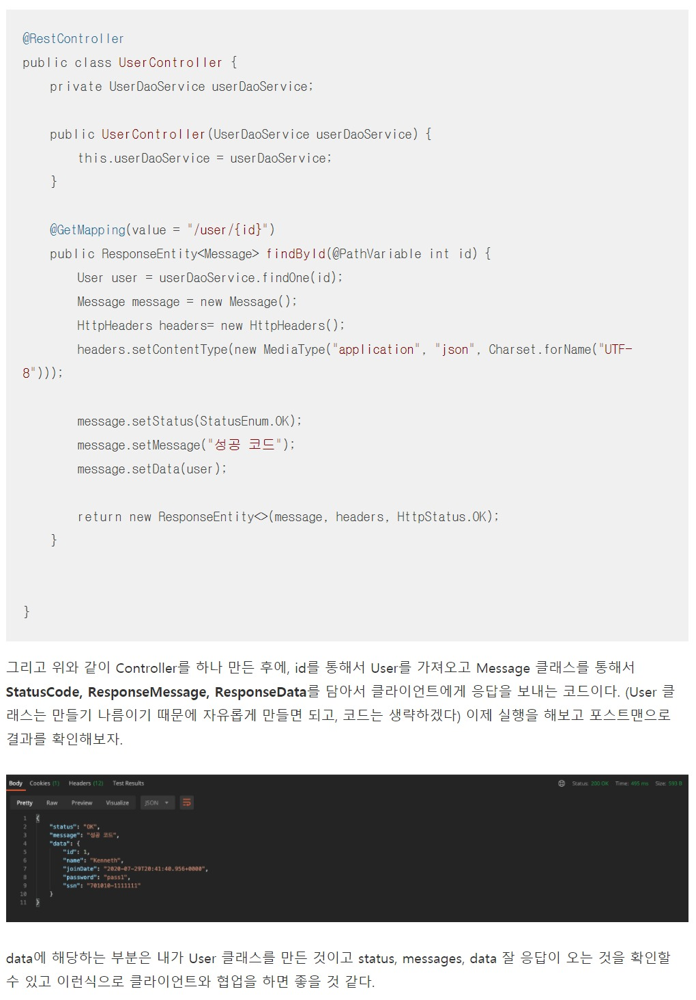

# SPRING_20210609

## 프론트에서 스네이크 네이밍룰로 작성된 데이터 받는 방법

- DTO 클래스에서 해당 데이터를 받는 변수위에 **@JsonProperty("변수명") 어노테이션**을 붙여준다!

```java
public class PostDTO {
    private String id;
    private String password;

    @JsonProperty("phone_number")
    private String phoneNumber;

    //....
}
```

- 하지만 JsonProperty는 변수가 많아지면 선언하기 번거러우므로, 클래스에 지정하는 방법도 있다.
- **JsonNaming**을 써주면 해결

```java
@JsonNaming(value=PropertyNamingStrategy.SnakeCaseStrategy.class)
public class PostDTO {
    private String id;
    private String password;

    @JsonProperty("phone_number")
    private String phoneNumber;

    private List<Car> carList;
}
//////////////////////////////
@JsonNaming(value=PropertyNamingStrategy.SnakeCaseStrategy.class)
public class Car {
    private String carName;

    private int carPrice;
}
```

## application.yml ?

- 옛날에는 스프링 프로젝트 생성하면
- application.properties가 아니라
- .yml 확장자의 파일이 생성되었다.
- 지금도 회사에서는 .yml이 편해서 많이 사용한다.
- .yml의 내용은 아래와 같이 작성한다.

```yml
server:
  port: 8082
```

## @PathVariable 사용 방법

```java
@DeleteMapping("/delete/{password}")
public void delete(@RequestParam String name, @PathVariable(required = false) String password) {
    System.out.println(name);
    System.out.println(password);
}
```

## @RequestBody 어노테이션

- POST 메소드로 넘어온 JSON 데이터를 캐치

```java
@RequestBody UserDTO userDto
```

## @ResponseBody 어노테이션

- 클라이언트 요청에 대해 서버에서 응답을 자바 객체를 `HTTP Response Body` 에 써서 준다.
- 쓰여지기 전에 `MessageConverter` 에서 변환이 이루어진다. 
    - `StringHttpMessageConverter`
    - `FormHttpMessageConverter`
    - `ByteArrayMessageConverter`
    - `MarshallingHttpMessageConverter`
    - `MappingJacksonHttpMessageConverter`
    - `SourceHttpMessageConverter`
    - `BufferedImagedHttpMessageConverter`
- `SpringBoot` 에서는 `Content-Type` 을 참고해서 Converter를 자동 선택해 사용한다.
- `@RestController`를 사용하면 `@ResponseBody` 생략 가능하다. 

## ResponseEntity<E> 는 뭘까?

- **개발자가 직접 HTTP의 body, headers, status code를 제어하도록 한다.**
- Client의 요청에 대한 응답을 한 번 더 감싸서 
- 처리 동작을 추가할 수 있게 해주거나, View가 아닌 HTTP 정보만을 반환해야 할 때 사용하는 객체이다.
    - 예를 들어, 응답의 상태코드에 따라 다른 결과 화면을 노출
    - Header값에 따라 다른 동작을 하게 하기 등등..

```java
@PutMapping("/put201")
public ResponseEntity<User> put201(@RequestBody User user) {
    return ResponseEntity.status(HttpStatus.CREATED).body(user);
}
```

- 아래는 재밌는 예제 (출처:https://juwonkim.tistory.com/m/161?category=848128) 
```java
@RequestMapping(value = "/test", method = RequestMethod.GET)
public void test2(Model model) throws JsonProcessingException {
    // body에 넣을 내용
    HashMap<Integer, String> map = new HashMap();
    map.put(1, "아");
    map.put(2, "오늘 야식은");
    map.put(3, "치킨이다");

    // headers에 넣을 내용
    HttpHeaders httpHeaders = new HttpHeaders();
    httpHeaders.add("food", "치킨");

    ResponseEntity<Map> responseEntity = new ResponseEntity(map, httpHeaders, HttpStatus.OK);

    // JSON 변환
    ObjectMapper objectMapper = new ObjectMapper();
    String jsonString = objectMapper.writeValueAsString(responseEntity);

    System.out.println(jsonString);
}
```

- 아래는 좀 더 도움이 되는 설명 
    - REST API란? https://meetup.toast.com/posts/92
    - ResponseEntitiy란? https://devlog-wjdrbs96.tistory.com/182
    
    
